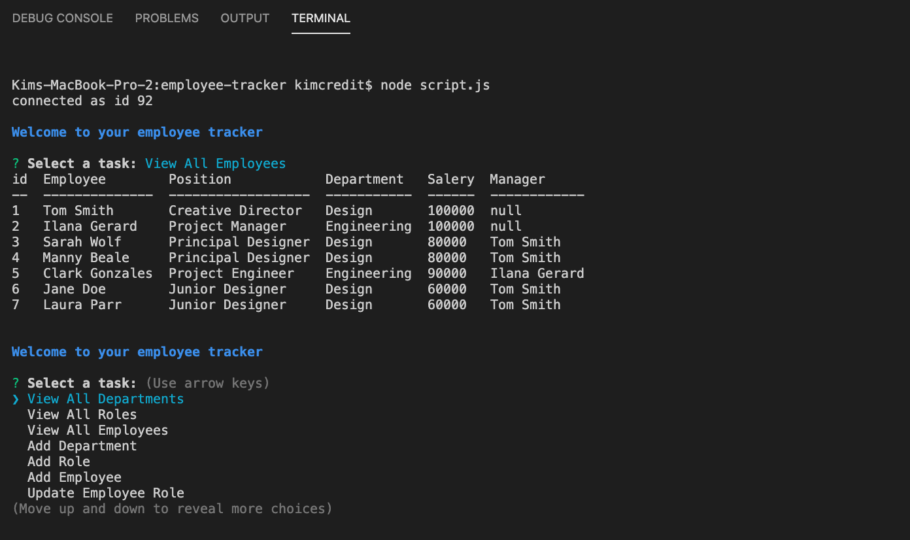

# employee-tracker

This employee tracker Content Management System is a CLI that uses node, inquirer, and MySQL to allow buisinesses to view and manage their departments, roles, and employees. 



## User Story
```
As a business owner
I want to be able to view and manage the departments, roles, and employees in my company
So that I can organize and plan my business
```

## Functionality 
```
When the user runs the application, they are first provided with a list of tasks: 
-  View All Departments
-  View All Roles
-  View All Employees
-  Add Department
-  Add Role
-  Add Employee
-  Update Employee Role
-  Exit

When the user chooses a view option, they are provided with a table showing 
the company's current data on that item. 

When the user chooses an add option, they asked through a series of prompts 
to provide all necessary data for their addition. They are then shown an 
updated version of the corresponding table. 
When the user chooses to update an employee role, they are asked to provide 
the ID of the employee they wish to update, and the ID of that employee's new role. 
They are then shown an updated version of the employees chart showing these changes. 
When the user is done making changes to their database, they can choose exit to stop 
the program from running.
```

## Credits
This App uses [Inquirer](https://www.npmjs.com/package/inquirer), [MySQL](https://www.npmjs.com/package/mysql), [console.table](https://www.npmjs.com/package/console.table), and [Chalk](https://www.npmjs.com/package/chalk). 

## Video Walkthrough
Want to know how it works?
View a walkthrough of this application in action at <https://www.youtube.com/watch?v=DdC30wc7CtU>

## Other Work
You can see some of my other work at <https://github.com/kimcredit>.    
